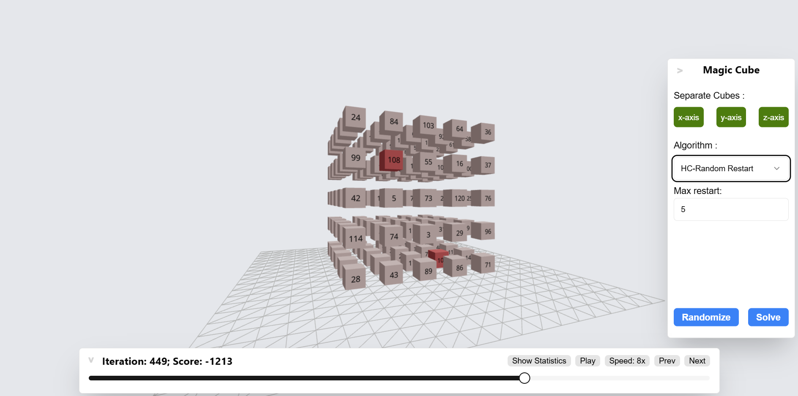
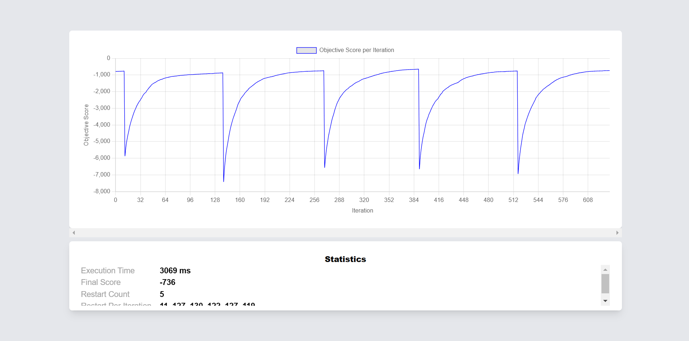

# Tugas Besar 1 IF3170 - Inteligensi Artifisial
Diagonal Magic Cube Solver Menggunakan Algoritma Pencarian Lokal<br><br>

<div style="display: flex; justify-content: center; align-items:center; gap: 20px; width:100%;">
  
  
</div>


## Deskripsi
<div align="justify">
Aplikasi ini merupakan solver untuk Diagonal Magic Cube menggunakan algoritma pencarian lokal seperti Hill Climbing, Genetic Algorithm, dan Simulated Annealing. Dibangun dengan React.js, Vite, TypeScript, dan Tailwind CSS untuk frontend, serta Golang untuk backend. Visualisasi dilakukan dengan three.js dan chart.js, serta pustaka UI shadcn dan react-spinners. <a href="https://docs.google.com/document/d/1QDj9Pi3HrBr2VdFIvsnrA8KXaISpEr4JaGlYRxOUPWw/edit?tab=t.0" target="_blank">Lihat spek disini.</a>
 </div> 
<br>

## Kebutuhan
1. [Node.js](https://nodejs.org/)
2. [Go](https://go.dev/doc/install)
<br><br>

## Cara Instalasi dan Menjalankan Program
  ```bash
  git clone https://github.com/rafimaliki/Tubes1_IF3170
  cd Tubes1_IF3170
```
<br>

### Menjalankan Frontend
Masuk ke direktori frontend:
```bash
cd src/fe
```
Instal dependensi:
```bash
npm install
```
Jalankan aplikasi:
```bash
npm run dev
```
Buka di localhost:5173.<br><br>
### Menjalankan Backend
Masuk ke direktori backend:
```bash
cd src/be
```
Jalankan backend:
```bash
go run main.go
```
<br>

## Pembagian Tugas

### Kelompok 4 - K03 - IF22

| Nama |  NIM  | Tugas |
|:-----:|:--------:|:------:|
| Maulana Muhamad Susetyo   | 13522127 | Algoritma Hill Climbing |
| Ahmad Rafi Maliki   |  13522137  |   Frontend dan visualisasi |
| Andi Marihot Sitorus   | 13522136 |   Algoritma Genetic |
| Nicholas Reymond Sihite   | 13522144 |  Algoritma Simulated Annealing |
